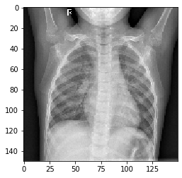
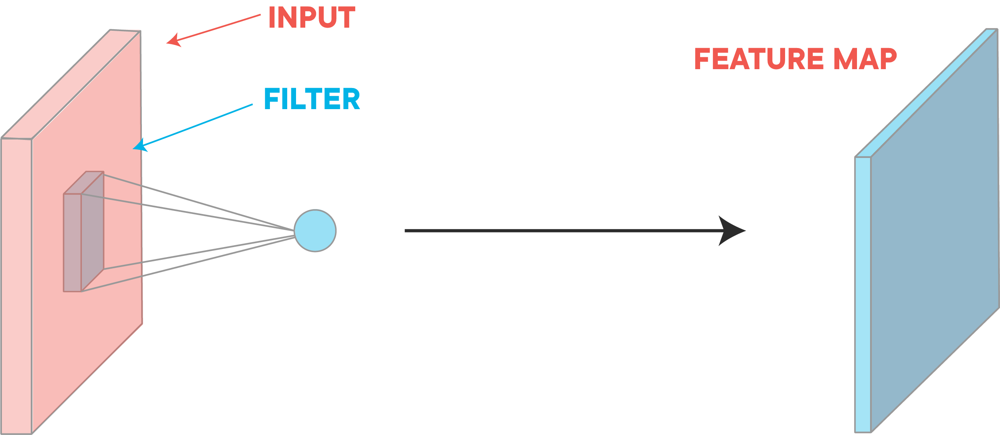
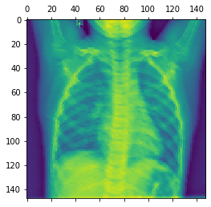
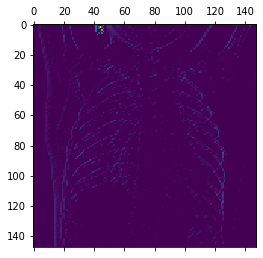
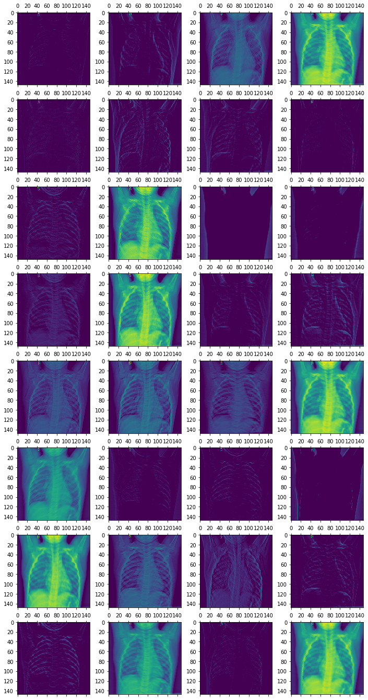
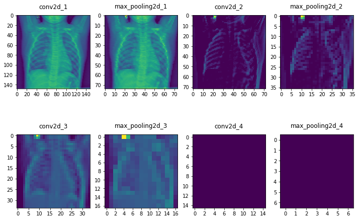

# Visualizing Intermediate Activations

## Introduction

Deep learning is extremely powerful and is helping to lead the advancement of many AI tasks. That said, deep learning is often criticized for having a lot of *black box* algorithms in that the components of the model itself are difficult to interpret. In the case of CNNs and image recognition, this is actually not true at all! In this lesson, you will explore how you can visualize the intermediate hidden layers within your CNN to uncover what sorts of features your deep network is uncovering through some of the various filters. With that, you'll gain interesting insights and knowledge as to how your CNN is *seeing* the world.  

## Objectives

You will be able to:

- Load a saved Keras model 
- Use Keras methods to visualize the activation functions in CNNs 

## Loading Our Previous Model


```python
from keras.models import load_model

model = load_model('cats_dogs_downsampled_with_augmentation_data.h5')
# As a reminder 
model.summary()  
```

    Model: "sequential"
    _________________________________________________________________
    Layer (type)                 Output Shape              Param #   
    =================================================================
    conv2d (Conv2D)              (None, 148, 148, 32)      896       
    _________________________________________________________________
    max_pooling2d (MaxPooling2D) (None, 74, 74, 32)        0         
    _________________________________________________________________
    conv2d_1 (Conv2D)            (None, 72, 72, 64)        18496     
    _________________________________________________________________
    max_pooling2d_1 (MaxPooling2 (None, 36, 36, 64)        0         
    _________________________________________________________________
    conv2d_2 (Conv2D)            (None, 34, 34, 128)       73856     
    _________________________________________________________________
    max_pooling2d_2 (MaxPooling2 (None, 17, 17, 128)       0         
    _________________________________________________________________
    conv2d_3 (Conv2D)            (None, 15, 15, 128)       147584    
    _________________________________________________________________
    max_pooling2d_3 (MaxPooling2 (None, 7, 7, 128)         0         
    _________________________________________________________________
    flatten (Flatten)            (None, 6272)              0         
    _________________________________________________________________
    dense (Dense)                (None, 512)               3211776   
    _________________________________________________________________
    dense_1 (Dense)              (None, 1)                 513       
    =================================================================
    Total params: 3,453,121
    Trainable params: 3,453,121
    Non-trainable params: 0
    _________________________________________________________________


## Loading an Image from the Training Set


```python
from tensorflow.keras.preprocessing import image
import numpy as np
import matplotlib.pyplot as plt
%matplotlib inline
```


```python
img_path = 'images/dog.1100.jpg'


img = image.load_img(img_path, target_size=(150, 150))
img_tensor = image.img_to_array(img)
img_tensor = np.expand_dims(img_tensor, axis=0)

#Follow the Original Model Preprocessing
img_tensor /= 255.

#Check tensor shape
print(img_tensor.shape)

#Preview an image
plt.imshow(img_tensor[0])
plt.show()
```

    (1, 150, 150, 3)


    

    


## Visualizing a Layer

In order to get a better sense of what representations our CNN is learning under the hood, we will visualize the feature maps generated during training. Recall from our previous discussions that CNNs work by applying a filter successively over an image. This transformation creates a new representation of the image which we call a feature map. 





```python
from keras import models
```


```python
# Extract model layer outputs
layer_outputs = [layer.output for layer in model.layers[:8]]

# Rather then a model with a single output, we are going to make a model to display the feature maps
activation_model = models.Model(inputs=model.input, outputs=layer_outputs)
```

If you return to the model summary, you can inspect the third dimension of each activation layer's output.


```python
model.summary()
```

    Model: "sequential"
    _________________________________________________________________
    Layer (type)                 Output Shape              Param #   
    =================================================================
    conv2d (Conv2D)              (None, 148, 148, 32)      896       
    _________________________________________________________________
    max_pooling2d (MaxPooling2D) (None, 74, 74, 32)        0         
    _________________________________________________________________
    conv2d_1 (Conv2D)            (None, 72, 72, 64)        18496     
    _________________________________________________________________
    max_pooling2d_1 (MaxPooling2 (None, 36, 36, 64)        0         
    _________________________________________________________________
    conv2d_2 (Conv2D)            (None, 34, 34, 128)       73856     
    _________________________________________________________________
    max_pooling2d_2 (MaxPooling2 (None, 17, 17, 128)       0         
    _________________________________________________________________
    conv2d_3 (Conv2D)            (None, 15, 15, 128)       147584    
    _________________________________________________________________
    max_pooling2d_3 (MaxPooling2 (None, 7, 7, 128)         0         
    _________________________________________________________________
    flatten (Flatten)            (None, 6272)              0         
    _________________________________________________________________
    dense (Dense)                (None, 512)               3211776   
    _________________________________________________________________
    dense_1 (Dense)              (None, 1)                 513       
    =================================================================
    Total params: 3,453,121
    Trainable params: 3,453,121
    Non-trainable params: 0
    _________________________________________________________________


From this, you can see that the initial two layers output feature maps that have 32 channels each. You can visualize each of these channels individually by slicing the tensor along that axis. Subsequentially, the next two layers have 64 channels each and the 5th through 8th layers have 128 channels each. Recall that this allows the CNN to detect successively more abstract patterns. Here's what slicing one of these feature maps and visualizing an individual channel looks like in practice:


```python
# Returns an array for each activation layer
activations = activation_model.predict(img_tensor)

first_layer_activation = activations[0]
print(first_layer_activation.shape)

# We slice the third channel and preview the results
plt.matshow(first_layer_activation[0, :, :, 3], cmap='viridis')
plt.show()
```

    (1, 148, 148, 32)


    

    


```python
# Repeating the process for another channel (the 30th)
activations = activation_model.predict(img_tensor)

first_layer_activation = activations[0]
print(first_layer_activation.shape)

plt.matshow(first_layer_activation[0, :, :, 30], cmap='viridis')
plt.show()
```

    (1, 148, 148, 32)


    

    


More extensively, we could also visualize all 32 of these channels from the first activation function.


```python
fig, axes = plt.subplots(8, 4, figsize=(12,24))
for i in range(32):
    row = i//4
    column = i%4
    ax = axes[row, column]
    first_layer_activation = activations[0]
    ax.matshow(first_layer_activation[0, :, :, i], cmap='viridis')
```


    

    


## Repeating for all Layers

Similarly, you could also visualize other layers. Below is the visualization of the 29th channel for each of the activation layers. (Recall that there are more channels in later layers.)


```python
fig, axes = plt.subplots(2,4, figsize=(12,8))

layer_names = []
for layer in model.layers[:8]:
    layer_names.append(layer.name)

for i in range(8):
    row = i//4
    column = i%4
    ax = axes[row, column]
    cur_layer = activations[i]
    ax.matshow(cur_layer[0, :, :, 29], cmap='viridis')
    ax.xaxis.set_ticks_position('bottom')
    ax.set_title(layer_names[i])
```


    

    


Note how the later layers are more abstract representations, and in the case of the final two layers, we see nothing at all. This demonstrates how the representations learned by CNN architectures become increasingly abstract with the depth of the layers. In the case of the blank images displayed, this indicates that the patterns were not present in the current image.

## Summary

In this lesson, you investigated how you can visualize feature maps, the representations learned by CNNs during training. While outside the scope of this lesson, there are other visualization techniques for CNNs such as visualizing the filters themselves, or visualizing heatmaps of the original image to identify where in an image patterns were identified. In the upcoming lab, you'll continue to practice visualizing feature maps, as you did here creating a complete visualization of all channels within each of the 8 model layers.
